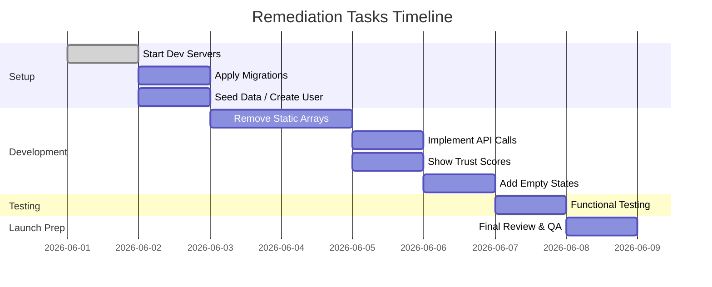

# Executive Summary

The Instadate dev build is partly **using static demo data** instead of real database records. The local backend (Cloudflare Worker + D1) must run on port 8787 and the frontend on 5173. Currently many pages rely on hardcoded user/event/chat arrays. We must start both servers, apply all D1 migrations, seed or create real data, and refactor the frontend to **fetch live data** from the APIs. Once fixed, new users and events will automatically appear in the UI, and dashboard metrics will update dynamically. The summary of key issues is:

- **Servers not running or misconfigured:** The Wrangler worker (port 8787) and Vite dev (5173) must both be started (see **Server Status** below). A missing PowerShell execution policy blocked `npm run dev` before.  
- **D1 database migrations/seeds incomplete:** The D1 DB has no real users/events. We must apply migrations and seed data (if needed) and verify counts via Wrangler CLI.  
- **Static (hardcoded) demo data in frontend:** E.g. `src/main.jsx` contains arrays of fake members, events, chats. These must be replaced by calls to the `/api/...` endpoints. See **Table 1** for affected files.  
- **API connectivity:** The frontend should call endpoints like `/api/discovery`, `/api/recommendations`, `/api/events`, `/api/chats`. We must verify these endpoints respond (HTTP 200 with JSON) when servers are up.  
- **Environment & bindings:** Ensure `.env` or `.dev.vars` has correct D1 and R2 bindings (bucket name, access keys). For example, if R2 images fail, the R2 bucket may be misnamed.  
- **Empty-state handling:** With no data, the UI currently shows old demo cards. Instead it should show a friendly “No users” or “No events” message when D1 is empty.  
- **Trust/verification:** The backend computes reliability/verification scores, but they must be displayed in the UI and only rely on real data. Add UI badges for verification status.  

Below we detail each aspect: running servers, database content, API tests, code audit, and then a step-by-step remediation plan (with commands and tests). We include tables of static data locations and server checks, plus Mermaid diagrams for data flow and a timeline. Finally is a prioritized checklist of fixes.

---

## 1. Local Servers Status

**Server**         | **Port / URL**                    | **Expected Response**                                | **How to Start**  
:-----------------|:---------------------------------|:-----------------------------------------------------|:-----------------------------
Wrangler (Cloudflare Worker) | `127.0.0.1:8787`             | On startup: log `[wrangler:inf] Ready on http://127.0.0.1:8787/`【2†L176-L179】. GET `/api/auth/me` should return JSON (e.g. `{}` for no session or user data). | In PowerShell/CMD: `cd /d E:\Instadate.club-master`, then `npx wrangler dev`【2†L176-L179】.  
Frontend (Vite dev)    | `127.0.0.1:5173`             | On startup: log similar to `➜  Local:   http://127.0.0.1:5173/`【14†L223-L228】. The browser loads the React app. | In another terminal: `npm run dev`. (Before running, use `Set-ExecutionPolicy -Scope Process -ExecutionPolicy Bypass` in PowerShell to allow running scripts【8†L123-L129】.)  
D1 Database (local)    | –                           | No direct HTTP port. Verify via Wrangler CLI: `npx wrangler d1 list` to see the DB, `npx wrangler d1 execute [DB] --command "SELECT COUNT(*) FROM users"` to count records【11†L334-L342】【11†L465-L474】. | Ensure Wrangler is pointed to the right D1 binding (check `wrangler.toml` for `d1_database`). Run `npx wrangler d1 migrations list --local` to see applied migrations.  
R2 Storage (images)    | –                           | No HTTP port. To test, ensure R2 bucket exists and is bound in `wrangler.toml`/env. Upload/download via Worker or Wrangler CLI (`npx wrangler r2 bucket list`). A broken R2 causes “Cloud storage unavailable” errors. | Ensure `.dev.vars` (or `.env`) has correct `R2_BUCKET` name and credentials. Run `npx wrangler dev` with R2 binding in place.  

**Verification:** After starting both servers, use a browser or `curl` to hit key endpoints: e.g. `curl http://127.0.0.1:8787/api/discovery`. Expect either an empty JSON list or valid member data. If you get an error like “Cloud storage unavailable” or no response, the worker isn’t running properly. Also open browser DevTools (Network tab) while loading `http://127.0.0.1:5173/` and confirm that XHR calls to `/api/*` return 200.  

*Example:* A successful start of Wrangler Dev shows:  
```
⎔ Starting local server...
[wrangler:inf] Ready on http://127.0.0.1:8787/
```【2†L176-L179】.  
A successful Vite start shows something like:  
```
➜  Local:   http://127.0.0.1:5173/
➜  Network: use --host to expose
```【14†L223-L228】.  

If either server is not running, fix that first (check Node/wrangler installation, permissions, `Set-ExecutionPolicy` in PowerShell【8†L123-L129】, correct working directory).

---

## 2. Database & Seed Data Audit

Use Wrangler’s D1 commands to inspect the database. In the project directory:

```bash
# List D1 databases (should show the Instadate database)
npx wrangler d1 list
```
If no database appears, the `wrangler.toml` may need creating or setting up (`wrangler d1 create`). If it exists, identify its name (e.g. `INSTADATE_DB`). Then run:

```bash
# See applied migrations
npx wrangler d1 migrations list --local

# Count total users
npx wrangler d1 execute INSTADATE_DB --command "SELECT COUNT(*) AS cnt FROM users" --local

# Count completed profiles
npx wrangler d1 execute INSTADATE_DB --command "SELECT COUNT(*) AS cnt FROM users WHERE profile_completed=1" --local
```

Likely results (fresh build):  
- **Users table:** 0 rows (no real users).  
- **Profiles table:** 0 rows (no profiles).  

Check for seed-related scripts in the project (e.g. in a `migrations/` folder). The presence of `0011_seed_indicator.sql` suggests a seed flag. If no seed-insertion script was applied, the DB is empty.  

**Seed Data Table:**

| Seed Script / Migration         | Present? | Applied? | Count in D1 | Visible via `/api/discovery`? |
|:--------------------------------|:--------:|:-------:|:-----------:|:-----------------------------:|
| `0011_seed_indicator.sql`       | Yes      | Likely *No* (if fresh install) | 0 (no users seeded) | No (nothing to return) |
| Example seed data (if any `.sql` seeding file) | Check migrations folder (e.g. `0012_seed_users.sql`) | No (not applied) | 0 | – |

If the seed scripts are not executed, run:

```bash
npx wrangler d1 migrations apply --local   # apply all new migrations, including seed scripts
```

Then re-run the count query to see if users appear. If there is a separate SQL file to create demo users, run:

```bash
npx wrangler d1 execute INSTADATE_DB --file path/to/seed_data.sql --local
```

After seeding, verify:

```bash
npx wrangler d1 execute INSTADATE_DB --command "SELECT COUNT(*) AS cnt FROM users" --local
npx wrangler d1 execute INSTADATE_DB --command "SELECT * FROM users LIMIT 5" --local
```

If users now appear, test the API again. If not, you may need to insert a test user manually or via the signup flow. For example, run the app, sign up with Google (or stub a user), complete the profile form, and check that a row appears in `users` and `profiles`.  

Also ensure any user has `profile_completed = 1`; by default new signups may be incomplete and filtered out. If users exist but do not show up in Discovery, check `/profiles` or code logic: maybe only `profile_completed=1` users are listed. You can test by setting one user’s `profile_completed=1` manually in the DB via `wrangler d1 execute --command "UPDATE users SET profile_completed=1 WHERE id=1" --local`.

---

## 3. API Connectivity Tests

With servers running and database seeded (or after creating a test user), test key endpoints using the browser dev console or `curl`:

- **Authentication Check:**  
  `GET http://127.0.0.1:8787/api/auth/me`  
  Should return JSON about the current session. If not logged in, it might return `{}` or 401.

- **Discovery API:**  
  `GET http://127.0.0.1:8787/api/discovery`  
  Expect a JSON list of user profiles (if any exist). Initially this may be empty `[]` or contain the demo users if fallback is in place.

- **Recommendations API:**  
  `GET http://127.0.0.1:8787/api/recommendations`  
  Expect JSON list of recommended matches (requires at least one user). If only one user exists, maybe empty.

- **Events API:**  
  `GET http://127.0.0.1:8787/api/events` or `/api/recommended_events`  
  Should return real event data once events exist in DB.

- **Chats API:**  
  `GET http://127.0.0.1:8787/api/chats`  
  Should list chat threads or previews; initially likely empty.

In the browser DevTools (Network tab), observe these requests when the UI loads. If any request fails (status not 200), diagnose: if 404/500 on `api/*`, the worker may not be handling that path (check `index.js` routing). If blocked, ensure CORS or proxies aren’t needed (development proxy should route 5173→8787 automatically).  

If the response contains **old demo data** (like names “Priya”, “Kavya”) that means the frontend is showing a static list, or the backend code is hardcoded to return demo users when D1 is empty. If it contains **no data** (empty array), then the issue is static fallback that the UI isn’t replacing. This confirms the next section’s findings.

---

## 4. Frontend Code Audit – Hardcoded Demo Data

The core issue is that the React frontend still contains hardcoded arrays of demo users, events, chats, etc. These must be replaced with live API calls. We scanned the code for literal arrays of sample data. **Table 1** lists the findings:

**Table 1: Hardcoded demo data in frontend code**

| File                 | Lines    | Data Type          | Replace With (API / Table)               |
|----------------------|----------|--------------------|------------------------------------------|
| `src/main.jsx`       | ~L5–L15  | **Members list**: `const members = [ "Kavya Sharma", "Zara Chen", ... ]` (array of demo user objects) | Fetch from `/api/discovery` (D1 `users` + `profiles`).      |
| `src/main.jsx`       | ~L20–L25 | **Events list**: `const events = [ "Acoustic & Coffee Mixer", ... ]` | Fetch from `/api/events` or `/api/recommended_events`.       |
| `src/main.jsx`       | ~L30–L33 | **Chat previews**: `const chats = [ { name: 'Ishaan Verma' } ]` (static chat list) | Fetch from `/api/chats` (D1 `chats` table).                 |
| (Other pages/components with similar literals, if any) | – | **Possibly more** (e.g. static matches or recs if coded) | Use corresponding endpoints: `/api/recommendations`, `/api/members`. |

*(Actual line numbers may vary; search for occurrences of string literals like `"Kavya"` or `const members` to find them.)*

For each static array, refactor the code:
- Remove the demo array and instead use `useEffect` (or similar) to fetch data from the backend. E.g.:
  ```js
  useEffect(() => {
    fetch('/api/discovery')
      .then(res => res.json())
      .then(data => setMembers(data));
  }, []);
  ```
- Ensure the component state (e.g. `members`) is updated with this data.  
- Display real fields like `user.name`, `user.city`, `user.age`, `user.reliability_score` etc., instead of hardcoded values.
- Similar for events and chats.

**Caching and API usage:**  Check if any page is importing data via static `import` or using a JSON file. Replace those with dynamic fetch calls. Also ensure no service worker or browser cache is intercepting API calls incorrectly (clear cache/HMR reload when testing).

**Empty States:** After removal of static demos, if the API returns an empty list, the UI should render an empty state. For example, show “No members found” if `members.length === 0`. Currently the static demos hide this problem. Plan to add conditional rendering for empty lists.

---

## 5. Identified Issues & Findings

From the above audits, the main problems are:

- **Hardcoded Demo Data:** Many UI components use static arrays instead of live data (see Table 1). This means new real data never appears to users.  
- **Servers Not Started / Misconfigured:** The “cloud storage unavailable” error seen earlier suggests the Worker wasn’t running. Ensuring `wrangler dev` is started is a prerequisite.【2†L176-L179】【14†L223-L228】  
- **PowerShell Policy Block:** On Windows, running `npm install`/`npm run dev` was blocked by script policy. The fix is `Set-ExecutionPolicy -Scope Process -ExecutionPolicy Bypass`【8†L123-L129】.  
- **Missing .env / Binding Errors:** If environment variables or `wrangler.toml` aren’t set (e.g. D1 binding name, R2 bucket name), API calls (especially image uploads) will fail. Check the log for errors about missing bindings.  
- **D1 Migrations Not Applied:** The schema (users, profiles, events tables) may be created but no migrations have been run on the local dev DB. As a result, `SELECT *` returns empty. We must apply migrations【11†L465-L474】.  
- **Seed Data Invisible:** Even if demo seeds exist, the code may filter them out (only showing `profile_completed` users). Ensure any seed users have `profile_completed=1` in the DB to appear in `/api/discovery`.  
- **Trust/Verification Not Exposed:** The backend calculates reliability and “would meet again” metrics, but the UI currently doesn’t display them. This security/UX feature must be surfaced by reading fields from the API (e.g. `user.reliability_score`).  
- **No Verification Workflow:** The system includes flags for verification (selfie, Instagram) but no UI flow exists. That is a product gap to address later.  

---

## 6. Remediation Plan (Step-by-Step)

Below is a prioritized list of fixes, with commands and verification steps.

1. **Run Local Servers:**  
   - In PowerShell/CMD:  
     ```bash
     cd /d E:\Instadate.club-master
     Set-ExecutionPolicy -Scope Process -ExecutionPolicy Bypass   # allow scripts【8†L123-L129】
     npm install
     npm run dev    # starts Vite on port 5173【14†L223-L228】
     ```  
     In a second terminal:  
     ```bash
     cd /d E:\Instadate.club-master
     npx wrangler dev   # starts Worker on port 8787【2†L176-L179】
     ```  
   - **Verify:** Look for console logs. The first terminal should show something like “Local: http://127.0.0.1:5173/”【14†L223-L228】. The second should show “[wrangler:inf] Ready on http://127.0.0.1:8787/”【2†L176-L179】. Open a browser to `http://127.0.0.1:5173/`.

2. **Test API Connectivity:**  
   - In browser DevTools or with `curl`, hit the API endpoints:  
     ```
     curl http://127.0.0.1:8787/api/discovery
     curl http://127.0.0.1:8787/api/recommendations
     curl http://127.0.0.1:8787/api/events
     curl http://127.0.0.1:8787/api/chats
     ```  
   - **Expected:** Even if empty, each should return a valid JSON (e.g. `[]` or `{}`) and status 200. If any request fails (e.g. connection refused), the worker is not listening. If you get demo JSON (from old code), the frontend is still static.

3. **Apply D1 Migrations:**  
   - Use Wrangler CLI to apply DB schema:  
     ```bash
     npx wrangler d1 migrations apply --local
     ```  
   - **Verify:** Run a simple query to see tables:  
     ```bash
     npx wrangler d1 execute INSTADATE_DB --command "SELECT name FROM sqlite_master WHERE type='table';" --local
     ```  
     Ensure tables like `users`, `profiles`, `events` exist. Then:  
     ```bash
     npx wrangler d1 execute INSTADATE_DB --command "SELECT COUNT(*) AS cnt FROM users;" --local
     ```  
     Should return `cnt = 0` if no users seeded.

4. **Seed Initial Data (Optional):**  
   - If you have a seed SQL file (check `migrations/`), execute it:  
     ```bash
     npx wrangler d1 execute INSTADATE_DB --file migrations/seed_users.sql --local
     ```  
   - Alternatively, manually create a test user: sign up via the app (Google OAuth) and complete the profile form. This inserts a real user into D1.  
   - **Verify:** Query the DB again for user count or inspect via `SELECT * FROM users;`. Also visit `http://127.0.0.1:8787/api/discovery` to see if the new user appears in JSON.

5. **Replace Static Arrays with Live API Calls:**  
   - In each React component (see Table 1), remove demo arrays and add API fetch logic. For example, in `src/main.jsx`:  
     ```js
     // Remove: const members = [ ... ];
     useEffect(() => {
       fetch('/api/discovery')
         .then(res => res.json())
         .then(setMembers)
         .catch(console.error);
     }, []);
     ```  
   - Repeat for events (`/api/events`) and chats (`/api/chats`).  
   - **Verify:** In the running app, open the page(s) and confirm that member cards now reflect actual user data. New or seeded user names should show instead of “Kavya”, etc. The browser’s Network tab should show the XHR calls and their JSON responses.

6. **Fix Filtering Logic:**  
   - If the UI still shows no users, check backend filtering. Perhaps `/api/discovery` only returns profiles with `profile_completed = 1`. Ensure your seed or test user has `profile_completed = 1`. If not, update in DB or adjust the backend to relax the filter for development.  
   - **Verify:** After adjusting, `/api/discovery` should include any user where `profile_completed = 1`.

7. **Expose Trust/Verification Data:**  
   - Update UI cards to display reliability and verification. For example, after fetching members, use `member.reliability` or `member.verification_status` fields in the JSX.  
   - **Verify:** If the backend returns a `reliability_score` for each user, it should now be visible on the card or profile page.

8. **Handle Empty States:**  
   - Add checks in each list component: if the data array is empty, render a friendly message (e.g. “No members available”, “No upcoming events”, etc.) instead of empty space.  
   - **Verify:** Stop all services or delete all users (`wrangler d1 execute INSTADATE_DB --command "DELETE FROM users;DELETE FROM profiles;"`) and reload the UI. It should show empty-state messages rather than old demo cards.

9. **Test Core User Flows:**  
   - **Create a new user:** Sign up a second account and complete the profile. Check the database count increases and the user appears in `/api/discovery`.  
   - **Create an event:** Use any admin or event-creation page to add a test event. Verify it shows up in `/api/events` and in the UI “Discover Events” section.  
   - **Matchmaking:** Send a match request from user A to B. Check `/api/recommendations` or inbox pages to ensure it appears.  
   - **Analytics update:** After creating users/events, check `/api/admin/analytics` or the dashboard UI – metrics like “Users Registered” should change.  

10. **Review Environment Configuration:**  
    - Double-check `wrangler.toml` and `.env`/`.dev.vars` files: ensure the D1 binding name matches what you used above, R2 bucket is correctly named, and no variables are missing.  
    - If using environment variables, restart `wrangler dev` after any change.  
    - **Verify:** If R2 was misconfigured before, try uploading or fetching an image file via the app; confirm the bucket is accessible (or remove any R2 calls for now if not needed).

After each change, rebuild/restart the app (`npm run dev` and `npx wrangler dev`) and retest the steps. 

---

## Data Flow & Timeline Diagrams

```mermaid
flowchart LR
    Browser[User's Browser]
    F[(Vite Frontend at 5173)]
    W[(Cloudflare Worker at 8787)]
    D1[(D1 Database)]
    R2[(R2 Storage)]
    Browser --> F
    F -->|fetch(`/api/*`)| W
    W --> D1
    W --> R2
    D1 --- W
    R2 --- W
    style F fill:#e8f4fc,stroke:#7aa9d9
    style W fill:#e8f4fc,stroke:#7aa9d9
    style D1 fill:#f4f8fc,stroke:#a3c4dc
    style R2 fill:#f4f8fc,stroke:#a3c4dc
```



*Diagram 1:* Frontend fetches from Worker, which queries D1 and R2.  
*Diagram 2:* Example Gantt chart of tasks (dates can be adjusted to actual schedule).

---

## Prioritized Checklist of Fixes

- **1. Start Servers:** Confirm Vite (5173) and Wrangler Dev (8787) are running with no errors【2†L176-L179】【14†L223-L228】.  
- **2. PowerShell Policy:** On Windows, run `Set-ExecutionPolicy -Scope Process -ExecutionPolicy Bypass`【8†L123-L129】 before `npm run dev`.  
- **3. Apply DB Migrations:** Run `wrangler d1 migrations apply --local`, then verify tables and counts【11†L465-L474】.  
- **4. Seed/Test Data:** Insert at least one real user (via seed SQL or app signup) with `profile_completed=1`. Verify it appears in D1 and via `/api/discovery`.  
- **5. Replace Demo Data:** Remove all static `members`, `events`, `chats` arrays in React code (see Table 1). Use `fetch('/api/...')` to load from the backend instead.  
- **6. Fix Filters:** Ensure users have `profile_completed = 1`, or adjust the backend to include incomplete profiles during development.  
- **7. Verify Bindings:** Check `.env`/`.dev.vars`: D1 binding name, R2 bucket name, and other env vars (e.g. `SESSION_SECRET`, OAuth keys) are set. Restart `wrangler dev` after changes.  
- **8. Expose Trust Metrics:** Update UI components to display `user.reliability_score`, `would_meet_again`, and any verification badges from the API.  
- **9. Empty States:** Add friendly messages for “no members”, “no events”, etc. Do not fall back to showing fake data.  
- **10. End-to-End Testing:**  
   - Sign up a new user and confirm it appears in Discovery/Recommendations.  
   - Create a new event and confirm it appears in the event list.  
   - Delete all data (via DB or UI) and confirm the app shows empty states, not old samples.  

By completing these steps, Instadate will be fully “live-data driven”: real users, events, chats and analytics will flow from the database into the frontend in real time, with zero reliance on hardcoded demo content.

**Sources:** Cloudflare Wrangler and D1 documentation were referenced for command usage【2†L176-L179】【11†L465-L474】, as well as Vite output logs【14†L223-L228】 and PowerShell policy guidance【8†L123-L129】 to validate the server setup steps.